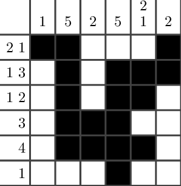

## Nonogram Solver

Simple Simple nonogram/picross solver in pascal,
tested working in FPC 3.2.0\
nonogram.pas is the main/"original" source code, while nonogram\_v2.pas and nonogram\_random is a slightly
modified implementation of it.

# Input
To change the input, edit "nonogram.txt". The program only consider the first two line.\
The first line is the "top" clue, and the second line is the "left" clue.\
Each "clue block" is separated by comma ",", and each clue within a "clue block" is separated by space " ".

# Example Input
For example\
\
can be written as
```
1,5,2,5,2 1,2
2 1,1 3,1 2,3,4,1
```
